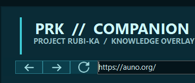

# Stealth's PRK Companion

> A clean, fullscreen web companion for **Anarchy Online** and **Project Rubi-Ka**.

PRK Companion puts the AO sites and quick math you actually use behind one hotkey—no Alt-Tab loop, no client injection, and no interaction with the game itself.

**` IS THE DEFAULT HOTKEY TO OPEN AND CLOSE THE OVERLAY.**

## Download and run

1. Download [`PRK-Companion-win-x64.zip`](https://github.com/stealth-prk/Stealths-PRK-Companion/releases/latest/download/PRK-Companion-win-x64.zip) from the latest release.
2. Extract the ZIP anywhere you like.
3. Double-click `PRK-Companion.exe`.

## Screenshots

### AO resources without leaving the game

### Browser controls without leaving the overlay

### Tune the overlay to your setup

## What’s inside

- **Global hotkey overlay** — Backtick/tilde by default, with F1, F8, and F10 options.
- **Persistent resource tabs** — once a site is loaded, switching away and back does not reload it.
- **AO quick links** — Auno, TinkerTools, PRKTools, PRK DB, Faffy’s PRK Guide, the PRK Portal, Bug Report, and AO-Universe resources.
- **AO-Universe dropdown** — home, implants, buffing, pocket bosses, dyna-camps, and the master blitz list in one compact menu.
- **Browser navigation** — back, forward, refresh, and an address/search bar remain available above every web tab.
- **Web Browser** — enter a URL directly or search the web from the overlay, then press `Enter` or `GO`.
- **Calculator** — normal keyboard support, chained formulas, Enter to calculate, and a visible calculation history.
- **Settings that stick** — overlay opacity, hotkey, and 80%–120% overlay scale are saved between sessions.
- **Compact navigation** — tighter link buttons leave more room on 1080p and smaller displays.

## Quick controls

| Action | Control |
| --- | --- |
| Show or hide the overlay | Assigned global hotkey |
| Return to AO | Assigned hotkey or `Esc` |
| Browse the active site | Back, forward, refresh, address bar, or `GO` |
| Close PRK Companion completely | `QUIT` |
| Open overlay options | `SETTINGS` |

## Deliberately simple and AO-safe

PRK Companion is only a Windows web companion. It does **not** inject into the AO client, read memory, automate gameplay, send input to AO, or modify the Project Rubi-Ka GUI mod.
